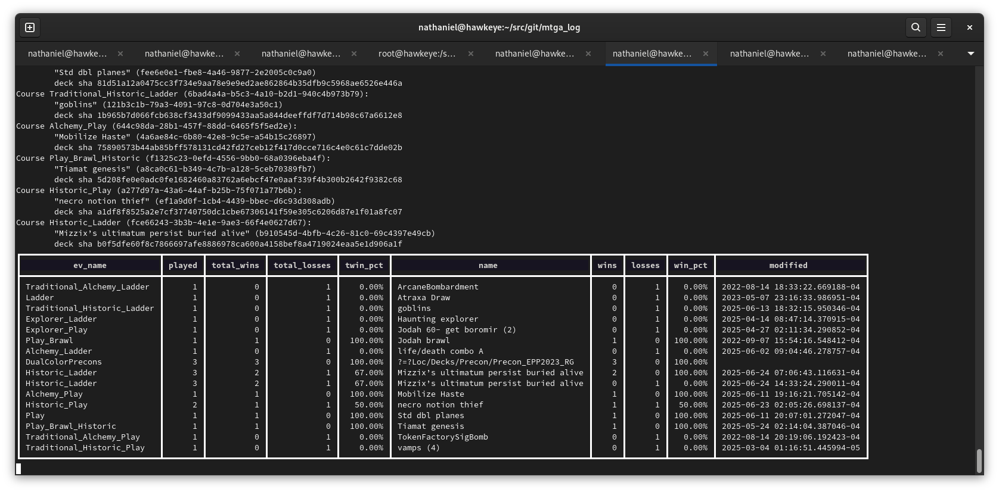

# mtga_log
parse mtga logs, insert data into postgres, print stats
it tracks wins/losses both in total, and per deck change as noted by the field modified within view vw_mtga_deck_stats
this is done by storing a sha256 of the deck contents along with the deck summary attributes
i might keep track of all changes to a deck in order to allow easy reverting to the highest winrate version of your deck,
 or at the least highlight the differences .

but for now let's just make sure this much works!


I have MTGA installed via proton in steam, but theoretically so long as you enable detailed logs from within the app
and locate the Player.log file and modify the $dir variable to point to it, this should work

# install

  if not already, install enable and start postgresql.
  modify connect string in the code or pg_hba.conf
```...
  host    all             all             127.0.0.1/32            trust
```

```
cpanm Date::Parse Date::Format File::ChangeNotify DBI Try::Tiny Text::ANSITable
```

```
cd ~/src/mtga_logs/
chmod +x mtgalog.pl
ln -s `pwd`/mtgalog.pl ~/bin/
```

  ****modify* the $dir variable to location of Player.log***

# usage
 
  before during or after starting MTGA and playing some matches, just run mtgalog.pl in a terminal



